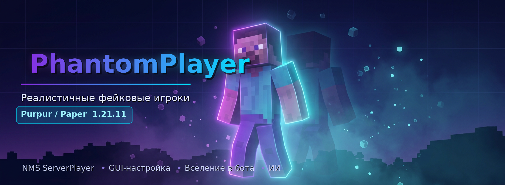
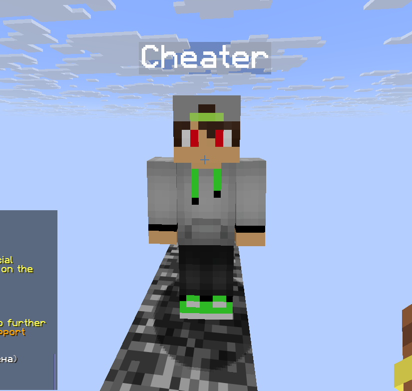
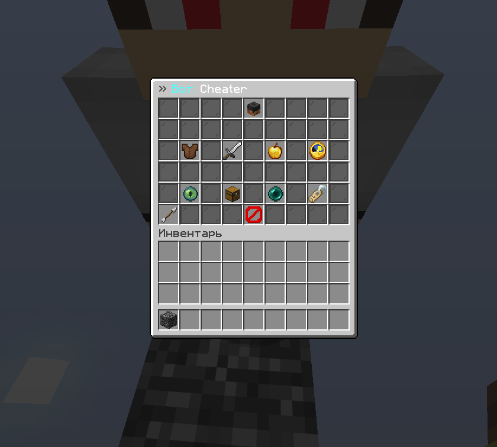

<p align="center">
  
</p>

# PhantomPlayer

**Реалистичные фейковые игроки для Minecraft 1.21.11 (Purpur / Paper)**

Плагин создаёт **настоящих** фейковых игроков на базе NMS `ServerPlayer`. Это не стойка-манекен и не голограмма: бот регистрируется в `PlayerList` сервера, поэтому его видят ванильные команды, плагины и другие игроки как обычного человека.

Главная фишка — **режим вселения**: ты играешь за бота так, будто просто зашёл с другого ника.

---

## Возможности

- 🧍 **Настоящий игрок** — виден в `/list` и TAB, получает урон, ломает блоки, ест, тонет, горит, попадает в статистику
- 🎮 **Полное вселение** — ходишь, бьёшь, строишь, пишешь в чат от имени бота
- 🖥️ **GUI-меню** — настройка всего без единой команды
- 🤖 **6 режимов ИИ** — стоять, следовать, охрана, охота, бродить, зеркало
- 🎨 **Скины** — подтягиваются с Mojang по нику
- 💾 **Сохранение** — боты переживают перезапуск сервера

---

## Скриншоты

<table>
  <tr>
    <td width="50%" align="center">
      <br>
      <sub><b>Бот в мире</b><br>Собственный скин и тег над головой</sub>
    </td>
    <td width="50%" align="center">
      <br>
      <sub><b>Инвентарь бота</b><br>Открывается прямо из меню — выдай броню, оружие и предметы</sub>
    </td>
  </tr>
</table>

---

## Установка

1. Скачай `PhantomPlayer-1.0.0.jar` из [релизов](../../releases)
2. Положи в папку `plugins/`
3. Перезапусти сервер

**Требования:** Purpur или Paper **1.21.11**, Java 21.

---

## Быстрый старт

```
/phantom create Steve      # создать бота
/phantom                   # открыть меню
/phantom possess Steve     # вселиться
/phantom gm creative       # включить креатив
/phantom release           # выйти обратно в себя
```

---

## Режим вселения

Команда `/phantom possess <ник>` или ПКМ по голове бота в меню.

**Как это устроено:** ты телепортируешься в тело бота, тебя прячут от всех остальных игроков, а бот каждый тик зеркалит твою позицию, поворот и позу. Физику считает твой собственный клиент — поэтому всё работает абсолютно нативно.

| Что делаешь | Результат |
|---|---|
| Ходишь, прыгаешь, бегаешь | Бот двигается вместе с тобой |
| Бьёшь ЛКМ | Реальный урон с учётом оружия |
| Строишь / ломаешь | Работает как обычно |
| Пишешь в чат | Сообщение уходит **от ника бота** |
| `F5` | Видишь себя от третьего лица |
| `/phantom gm creative` | Креатив прямо во время игры |

Инвентарь бота выдаётся тебе на время вселения. Всё, что наберёшь — останется у бота после выхода.

При выходе (`/phantom release`) возвращаются твои вещи, здоровье, опыт, позиция и игровой режим. Если бот погибнет — тебя автоматически вернёт в своё тело.

---

## Команды

| Команда | Описание | Право |
|---|---|---|
| `/phantom` | Открыть меню | `phantom.use` |
| `/phantom create <ник>` | Создать бота | `phantom.create` |
| `/phantom remove <ник>` | Удалить бота | `phantom.create` |
| `/phantom possess <ник>` | Вселиться в бота | `phantom.possess` |
| `/phantom release` | Выйти из бота | — |
| `/phantom gm <режим>` | Сменить игровой режим | — |
| `/phantom tp <ник>` | Телепорт к боту | — |
| `/phantom list` | Список ботов | — |
| `/phantom removeall` | Удалить всех | `phantom.admin` |
| `/phantom reload` | Перезагрузить конфиг | `phantom.admin` |

Алиасы: `/ph`, `/bot`, `/fakeplayer`

### Права

- `phantom.use` — по умолчанию **всем**
- `phantom.create`, `phantom.possess` — по умолчанию **операторам**
- `phantom.admin` — полный доступ к чужим ботам

---

## Меню

Открывается через `/phantom`. Список ботов — головы с их скинами:

- **ЛКМ** — настройки
- **ПКМ** — вселиться
- **Shift+ЛКМ** — телепорт к боту

### Разделы

**Внешность** — скин (ввод ника или копирование своего), видимость в TAB, тег имени, свечение, столкновения, приседание

**Поведение и ИИ** — режим ИИ, кого атаковать, взгляд на игроков, дистанция следования, радиус атаки, задержка удара, точка охраны

**Характеристики** — максимум HP, скорость, игровой режим, неуязвимость, авто-респавн, дроп вещей, копирование твоих статов

**Реализм** — голод, урон от огня, утопление, живые движения головой, случайные взмахи, чат

---

## Режимы ИИ

| Режим | Поведение |
|---|---|
| **Стоять** | Стоит на месте, поворачивает голову к игрокам |
| **Следовать** | Идёт за владельцем, отбивается от врагов |
| **Охрана** | Держит позицию, атакует врагов рядом |
| **Охота** | Активно ищет и преследует цели |
| **Бродить** | Свободно гуляет по округе |
| **Зеркало** | Повторяет движения владельца |

Цели настраиваются отдельно: никого / монстров / животных / игроков / всех.

---

## Конфигурация

`plugins/PhantomPlayer/config.yml` — параметры по умолчанию, настройки ИИ, вселения, реализма, лимиты ботов, автосохранение.

`plugins/PhantomPlayer/bots.yml` — генерируется автоматически: позиции, настройки, инвентарь и HP всех ботов. Восстанавливается при старте сервера.

---

## Сборка из исходников

Нужен **JDK 21**.

```bash
git clone https://github.com/AnweraDevv1/PhantomPlayer.git
cd PhantomPlayer
./gradlew build
```

JAR появится в `build/libs/`.

Первая сборка занимает ~6 минут: `paperweight` скачивает и ремапит серверный jar. Последующие — секунды.

---

## Технические детали

### Почему бот «настоящий»

Создаётся полноценный `net.minecraft.server.level.ServerPlayer` и добавляется в `PlayerList` через `placeNewPlayer(...)`. Поэтому бот обрабатывается сервером и другими плагинами как обычный игрок.

### Фейковое соединение

У бота нет клиента, но `ServerPlayer` требует `Connection`, иначе сервер падает с NPE. Используется `EmbeddedChannel`, исходящие пакеты глушатся, `tick()` переопределён — keep-alive боту слать некому.

### Собственная физика

Ключевой момент: `ServerPlayer` управляется клиентом. Сервер **не применяет** к игрокам гравитацию и `setVelocity` — он лишь отправляет пакет реальному клиенту. У бота клиента нет, поэтому `setVelocity` для него не делает ничего.

Класс `Physics` считает движение вручную: гравитация, столкновения хитбоксом 0.6×1.8, шаг вверх на блок, скольжение вдоль стен, прыжок через препятствия, всплытие в воде. Перемещение выполняется через `absSnapTo`.

### Особенности 1.21.11, учтённые в коде

- `GameProfile` стал `record`; у профиля из двухаргументного конструктора `properties()` неизменяем — скин задаётся через `new GameProfile(uuid, name, propertyMap)`
- `PropertyMap` больше не имеет пустого конструктора — оборачивает `Multimap`
- `RelativeMovement` переименован в `Relative`
- `PlayerDeathEvent` живёт в `org.bukkit.event.entity`, а не в `...event.player`

Проект собирается против Mojang-маппингов (`paperweight-userdev` + `MOJANG_PRODUCTION`), как требует Paper начиная с 1.21.11.

### Прочее

UUID ботов генерируются как `OfflinePlayer:<ник>` — так же, как у обычных оффлайн-игроков, чтобы плагины прав и статистики работали корректно.

Используется `GlobalRegionScheduler`; запросы за скинами уходят в `AsyncScheduler`, результат применяется в основном потоке.

---

## Известные ограничения

- ИИ не строит сложные маршруты — прямое движение с автопрыжком, а не полноценный A* pathfinding. Через лабиринт бот не пройдёт.
- Скины требуют доступа к API Mojang. Без интернета бот получит стандартный скин.
- Под Folia не тестировалось (`folia-supported: false`).

---

## Лицензия

[MIT](LICENSE)
